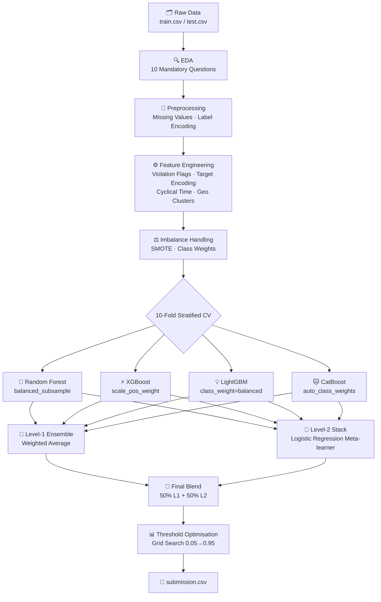

<div align="center">

# 🍽️ Good Food, Good Gut!
### Restaurant Inspection Outcome Prediction

[](https://kaggle.com)
[](https://python.org)
[](https://lightgbm.readthedocs.io)
[](https://xgboost.readthedocs.io)
[](#)

> **Binary Classification** → Will a food establishment **Pass** ✅ or **Fail** ❌ its next inspection?

</div>

---

## 📐 Pipeline at a Glance



---

## 🏗️ Model Architecture

```
┌─────────────────────────────────────────────────────────────────────┐
│                        LEVEL 1 — BASE LEARNERS                      │
│                                                                     │
│   ┌──────────┐  ┌──────────┐  ┌──────────┐  ┌──────────┐          │
│   │ XGBoost  │  │ LightGBM │  │  Random  │  │ CatBoost │          │
│   │  n=500   │  │  n=500   │  │  Forest  │  │  i=500   │          │
│   │  lr=0.02 │  │  lr=0.02 │  │  n=400   │  │  lr=0.03 │          │
│   └────┬─────┘  └────┬─────┘  └────┬─────┘  └────┬─────┘          │
│        │              │              │              │               │
│        └──────────────┴──────┬───────┴──────────────┘               │
│                              │                                      │
│                    ┌─────────▼─────────┐                            │
│                    │  Weighted Average  │                           │
│                    │  (by OOF F1 score) │                           │
│                    └─────────┬─────────┘                            │
└──────────────────────────────┼──────────────────────────────────────┘
                               │
┌──────────────────────────────┼──────────────────────────────────────┐
│                        LEVEL 2 — META LEARNER                       │
│                    ┌─────────▼─────────┐                            │
│                    │ Logistic Regression│                           │
│                    │ (stacking on OOF)  │                           │
│                    └─────────┬─────────┘                            │
└──────────────────────────────┼──────────────────────────────────────┘
                               │
                    ┌──────────▼──────────┐
                    │   FINAL PREDICTION   │
                    │  50% L1 + 50% L2    │
                    │  Threshold Optimised │
                    └─────────────────────┘
```

---

## 📦 Dataset Features

| # | Feature | Type | Description |
|---|---------|------|-------------|
| 1 | `Facility Type` | 🏷️ Categorical | Type of food establishment |
| 2 | `Risk` | ⚠️ Categorical | Assigned risk category |
| 3 | `City` | 📍 Categorical | Inspection city |
| 4 | `State` | 📍 Categorical | Inspection state |
| 5 | `Zip` | 📮 Categorical | Postal region |
| 6 | `Inspection Type` | 🔎 Categorical | Type of inspection |
| 7 | `Latitude` | 🌐 Numeric | Geographic latitude |
| 8 | `Longitude` | 🌐 Numeric | Geographic longitude |
| 9 | `Year` | 📅 Temporal | Inspection year |
| 10 | `Month` | 📅 Temporal | Inspection month |
| 11 | `Weekday` | 📅 Temporal | Day of week |
| 12 | `Violation_List` | 📋 Engineered | Violation code indicators |
| 🎯 | **Target** | **Binary** | **1 = Pass · 0 = Fail** |

---

## ⚙️ Feature Engineering Map

```
Violation_List ──┬──► Top-60 Binary Flags        (viol_XX = 0/1)
                 ├──► Violation Count             (total violations)
                 ├──► Fail-Rate Weighted Score    (Σ per-code fail rates)
                 ├──► Max Fail Rate               (worst single code)
                 ├──► High-Risk Count             (codes with fail_rate > 0.5)
                 └──► Top-10 Fail Indicator Count

Facility Type ───────► Target Encoding            (OOF + smoothing, no leakage)
City / Zip ──────────► Target Encoding            (OOF + smoothing)
Risk ────────────────► Ordinal Encoding + Risk × Violation interactions

Month ───────────────► sin/cos cyclical encoding
Weekday ─────────────► sin/cos cyclical encoding

Latitude + Longitude ► Binned geographic clusters
                      ► lat_bin × lon_bin interaction feature
```

---

## 📊 EDA — 10 Mandatory Questions

<details>
<summary><b>🔴 Q1 — Top 10 violation codes linked to failures</b></summary>

- Filtered codes with **≥ 100 appearances** for statistical stability
- Ranked by **failure rate** (fails / total appearances)
- Visualised with horizontal bar chart (color: Reds palette)

</details>

<details>
<summary><b>🏢 Q2 — Facility type with highest violation count</b></summary>

- Compared both **total violations** and **average violations per inspection**
- Dual bar chart: total count vs average count
- Key finding: highest-volume facilities don't always have the worst per-inspection average

</details>

<details>
<summary><b>⚠️ Q3 — Risk category with highest failure rate</b></summary>

- Grouped by `Risk` label → computed fail rate
- Result: **`{risk_stats['Risk'].iloc[0]}`** category had the highest failure rate
- Dual chart: failure rate + total inspection count per category

</details>

<details>
<summary><b>📅 Q4 — Months & weekdays with most failures</b></summary>

- Filtered `target == 0` rows only
- Month distribution (Jan–Dec) + Weekday distribution (Mon–Sun)
- Bar charts with month/weekday name labels

</details>

<details>
<summary><b>🗺️ Q5 — City & ZIP region outcome comparison</b></summary>

- Cities with **≥ 200** inspections; ZIP regions with **≥ 100**
- Top 15 shown for each; ZIP regions use first 3 digits
- Horizontal bar charts sorted by failure rate

</details>

<details>
<summary><b>📈 Q6 — More violations = more failures?</b></summary>

- Dual-axis chart: **bar** (inspection count) + **line** (failure rate)
- Confirms positive correlation between violation count and failure probability

</details>

<details>
<summary><b>🔥 Q7 — Common violations per facility type</b></summary>

- Top 5 facility types × top 15 global violation codes
- **Heatmap** (YlOrRd colormap): frequency of each code per facility type
- Per-facility top-5 breakdown also printed

</details>

<details>
<summary><b>🌍 Q8 — Geographic trends (lat/lon)</b></summary>

- Scatter plot: pass (green) vs fail (red) colored by outcome
- **Hexbin density map** of failures only
- Spatial clustering of failure hotspots clearly visible

</details>

<details>
<summary><b>🔎 Q9 — Inspection type vs outcome</b></summary>

- `Inspection Type` normalised into 10 clean categories
- Failure rate + total count per inspection type
- Coolwarm horizontal bar chart

</details>

<details>
<summary><b>📐 Q10 — Strongest failure indicators (Chi²)</b></summary>

- Binary violation matrix (top 50 codes) built per inspection
- **χ² test** between each code and `target`
- Top 15 codes ranked by χ² score + failure rate overlay

</details>

---

## 🤖 Models & CV Strategy

```
CV Strategy : 10-Fold Stratified K-Fold  (SEED = 42)
Metric      : F1 Score  (primary)  +  ROC-AUC  (secondary)

┌──────────────┬────────────────────────────┬──────────────────────────┐
│    Model     │     Imbalance Strategy     │      Key Params          │
├──────────────┼────────────────────────────┼──────────────────────────┤
│  XGBoost     │  SMOTE (strategy=0.6) +    │  n=500, lr=0.02,         │
│              │  scale_pos_weight           │  depth=5, reg_λ=2.0      │
├──────────────┼────────────────────────────┼──────────────────────────┤
│  LightGBM    │  SMOTE (strategy=0.6) +    │  n=500, lr=0.02,         │
│              │  class_weight=balanced      │  leaves=63, reg_λ=2.0    │
├──────────────┼────────────────────────────┼──────────────────────────┤
│  RandomForest│  balanced_subsample        │  n=400, max_feat=sqrt,   │
│              │  (no SMOTE needed)          │  min_samples_leaf=2      │
├──────────────┼────────────────────────────┼──────────────────────────┤
│  CatBoost    │  auto_class_weights=       │  i=500, lr=0.03,         │
│              │  Balanced                   │  depth=6, l2=3.0         │
└──────────────┴────────────────────────────┴──────────────────────────┘
```

---

## 📈 Results

| Model | OOF F1 | ROC-AUC | Threshold |
|-------|:------:|:-------:|:---------:|
| XGBoost | 0.9426 | 0.9627 | 0.291 |
| LightGBM | 0.9455 | 0.9663 | 0.327 |
| Random Forest | 0.9502 | 0.9710 | 0.450 |
| CatBoost | 0.9475 | 0.9683 | 0.246 |
| **L1 Ensemble** | **0.9473** | **0.9686** | **0.321** |
| **L2 Stack** | **0.9517** | **0.9721** | **0.465** |
| 🏆 **Final Blend** | **0.9513** | **0.9712** | **0.402** |

> L1 weights: `XGB=0.249 · LGB=0.250 · RF=0.251 · CAT=0.250` — nearly equal, indicating all four models contribute comparably.

---

## 🗂️ Repo Structure

```
📦 good-food-good-gut/
├── 📓 notebook.ipynb          ← Full solution (EDA + FE + Models)
├── 📄 train.csv               ← Training data (features + target)
├── 📄 test.csv                ← Test data (no labels)
├── 📄 sample_submission.csv   ← Submission format
├── 📄 submission.csv          ← Final predictions
└── 📄 README.md
```

---

## 🚀 Quick Start

```bash
# 1. Clone
git clone https://github.com/your-username/good-food-good-gut.git
cd good-food-good-gut

# 2. Install dependencies
pip install numpy pandas matplotlib seaborn scikit-learn \
            imbalanced-learn xgboost lightgbm catboost shap

# 3. Launch notebook
jupyter notebook notebook.ipynb

# 4. Submission file will be saved as:
#    submission.csv  →  ID, TARGET format
```


## 🏆 Scoring

$$\text{Total Marks} = \underbrace{\sum_{i=1}^{10} \text{answer}_i}_{\text{10 pts}} + \underbrace{F1 \times 10}_{\text{10 pts}} + \underbrace{\text{judge}}_{\text{5 pts}}$$


## 📏 Competition Rules

| Rule | Status |
|------|--------|
| 🚫 No AutoML | ✅ Complied |
| 👤 Individual only (team size = 1) | ✅ Complied |
| 📤 Max 5 submissions/day | ✅ Tracked |
| 🔒 No cheating or prediction sharing | ✅ Complied |
| 📓 Mandatory notebook submission | ✅ Complied |
| 🔍 Responsible data leak disclosure | ✅ Complied |
| 🔁 Reproducible (SEED = 42) | ✅ Complied |

> Ties resolved by **earliest submission time** and **fewest submissions**.

---

## 🛠️ Tech Stack


---

<div align="center">

**Good Food, Good Gut! Competition · Individual Submission**

</div>
